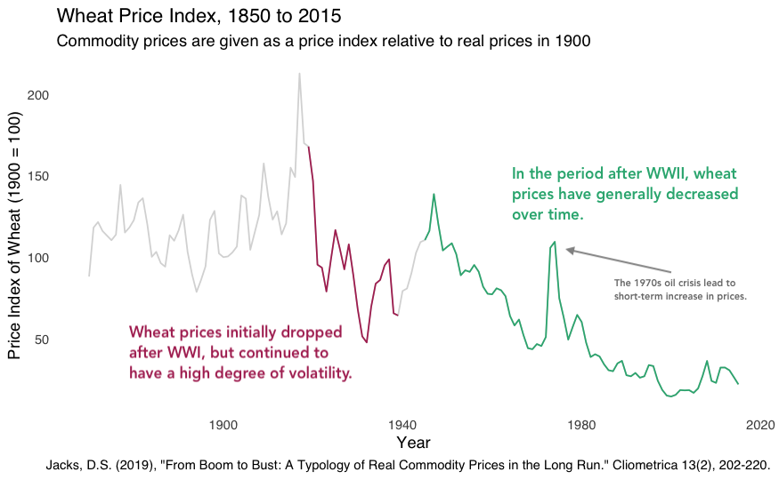

## Getting Started

Before running this notebook, select "Session > Restart R and Clear Output" in
the menu above to start a new R session. This will clear any old data sets and
give us a blank slate to start with.

After starting a new session, run the following code chunk to load the
libraries and data that we will be working with today.

```{r, include=FALSE, message=FALSE}
library(tidyverse)
library(ggrepel)
library(smodels)
library(stringi)

theme_set(theme_minimal())
options(dplyr.summarise.inform = FALSE)

food <- read_csv(file.path("data", "food.csv"))
food_prices <- read_csv(file.path("data", "food_prices.csv"))
```

I have set the options `include=FALSE` and `message=FALSE` to avoid cluttering
the solutions with all the output from this code.

# Storytelling with Data

## Overview

Most classes in statistics and data science spend a lot of time discussing and
practicing the technical skills of working with data, such as building complex
graphics, collecting and cleaning data, and building inferential and predictive
models. Often little to no time is spent discussing how to present and use the
output of these analyses. Today's notes are an attempt to partially rectify
this. We will continue to make the presentation of our data a part of our
discussion throughout the course.

Today's material comes from a number of sources, which I suggest you check out
if you are interested in studying these topics further. Specifically:

- *Storytelling with Data* by Cole Nussbaumer Knaflic
- *The Visual Display of Quantitative Information* by Edward Tufte
- *Beautiful Evidence* by Edward Tufte
- *The Functional Art* by Alberto Cairo
- *Dear Data* by Giorgia Lupi and Stefanie Posavec

I can share digital copies of these with students who are interested.

These notes are a very opinionated set of recommendations for how to start
thinking about telling stories with data. Feel free to deviate from these
suggestions in your work as need, though be prepared to explain why you
choose to do something different. Note that the notes here are strictly about
doing *explanatory* analysis; this is the mode where we want to convey
a specific point of information to our audience. This differs from an
exploratory presentation, where we expect the audience to help discover new
things in the dataset. Many of the recommendations are different for these
two modes, if not entirely contradictory.

In the following sections we will discuss the process of telling a story
with data from four perspectives:

1. Choosing effective visuals
2. Reducing clutter
3. Focusing attention
4. Use narrative logic

Each of these are discussed below.

### Choosing effective visuals

We have discussed a number of methods for producing graphics to describe our
data, but have not spent much time talking about the specific uses of each
graphic type. Here is a non-exhaustive list of common use-cases for some of
the methods we have seen so far:

- **scatterplot**'s are good at showing the relationship between two variables
when at least on variable is continuous; they become hard to read when there
are more than a few hundred points (or less if the data are heavily clustered);
also useful for showing spatial data
- **scatterplot with bestfit line** can be used to suggest a more model based
relationship between two variables
- **line plot** is useful for showing the relationship between time (almost
always on the x-axis) and another continuous output; can show multiple lines
on the same plot when needed
- **slopegraph** is a line plot with only two points on the x-axis; this is a
favorite in business analyses for showing the change of variables from one
point in time to another
- **bar plot** shows the relationship between a summary statistic and a
categorical variable; often used to show counts, but also useful to show
sums, means, and other concrete numeric variables
- **confidence interval plot** show the average value of a continuous variable
in relationship with a discrete variable
- **histogram**, **box-plot**, **ribbon plot** all show the distribution of a
continuous variable; these can be confusing for non-technical audiences, but
are good for some applications where the specific distribution is important
- **numbers** one or two numbers can often serve as the best way to describe
the output of a dataset; don't overlook this in cases where other methods only
complicate the story
- **tables** also have their uses, particularly when presenting the results of
a regression analysis to a technical audience; I would generally avoid, however,
with oral presentations as tables can be too difficult to interpret on the fly

Most of these have been shown in the previous notebooks. Those that have not
consist of using a slightly different geometry, but follow from the same
principles that we have already developed.

### Reduce clutter

As mentioned in the notes from last class, when presenting data visualizations
it is important to reduce clutter. That is, we should aim to remove any element
of a plot that is not relevant to the overall message.

Here are some strategies to reduce clutter in plots:

1. Use minimal themes, such as `theme_sm` or, if you think gridlines are useful,
try `theme_minimal`.
2. Make sure that categories have a natural ordering; this can be achieved by
using `fct_inorder` with `arrange`, or `factor` with manually defined levels.
3. If possible and logical, reduce the number of categories using `fct_lump`.
4. Avoid if possible with `show.legend = FALSE`. For size, consider using easily
described scales, such as `scale_size_area`.
5. Consider using a logarithmic or sqrt scale for the x and y axis if it better
spreads out the dataset.
6. Consider using the function `slice_sample` to show or label only a subset of
the data if there are otherwise too many points.

There are also a number of strategies involving color that we will discuss in
another section.

Here is an example of how to reduce the clutter in a plot that uses size to show
the number of food items in each food group:

```{r}
food %>%
  group_by(food_group) %>%
  summarize(sm_mean(sugar), sm_mean(calories), sm_count()) %>%
  ggplot(aes(calories_mean, sugar_mean)) +
    geom_point(aes(size = count), color = "grey85", show.legend = FALSE) +
    geom_text_repel(aes(label = food_group)) +
    scale_size_area() +
    theme_sm()
```

And here is an example of using sampling to reduce clutter in a scatter
plot:

```{r}
# grab three random foods from each food group
food_sample <- food %>%
  group_by(food_group) %>%
  slice_sample(n = 3)

food %>%
  ggplot(aes(calories, sugar)) +
    geom_point(color = "grey90") +
    geom_text_repel(aes(label = item), data = food_sample)
```

Notice that the previous plot will change each time you run the code.
To stop this, you can add `set.seed(1)` to fix the sampling. Change
the number `1` to a different integer until you have a plot you are
happy with.

### Focusing Attention

Now that we have decluttered our tables and visualizations, it is
time to think about where we want to focus the attention of our
audience. This should help focus on the key take-away point that
are associated with our story. Two ways to focus attention are
through the use of color and annotations, both of which we will
focus on here.

When using a visualization to make an argument or tell a story,
I typically use three colors:

- **black** for titles, axes, labels, and annotations
- **light grey** to show data used primarily for context and
for less-important annotations; I recommend something between
"grey80" and "grey90"
- one **highlight color** to show a particular part of the data
of interest to the story; can also use to give particular
attention to labels or annotations

You have already seen approach in several examples from the last
few notebooks.

Generally you should consider using the same highlight color across
all of your visualizations. While one highlight is often sufficient,
there are cases for using multiple. You can use a lighter shade of
the highlight color to show a secondary subset related to the first.
It is also sometimes useful to use 2 or 3 different highlight colors
if you have two groups of data to differentiate or if there are
canonical colors that will make the plot quickly understandable
(i.e., blue and red for Democrats and Republicans).

Annotations are short textual labels or descriptions that are
put on top of a plot to explain a region of the plot or a specific
subset of the data. These can be used to give more context to the
plot by giving descriptive names to extreme corners, for example
the "healthy-wealthy" and "sick-poor" descriptions from Hans
Roslin's presentation. They can also guide the audience to the
purpose of a visualization by making an in-line argument. These
annotations can be added as layers to plots in R, but it is often
better and easier to add them afterwards using a different piece
of software.

Finally, we can also add manual guidelines to the plot to focus
attention to a point of change in the plot. These often take the
form of dashed horizontal or vertical lines. These can be created
by adding explicit geometry layers, such as:

```{r, eval = FALSE}
# Just examples ; these will not run unless added to a plot
geom_hline(yintercept = 1, linetype = "dashed")
geom_vline(xintercept = 1, linetype = "dotted")
geom_abline(slope = 1, intercept = 0, linetype = "longdash")
```

These are particularly helpful for showing a particular time
point when using a date or time variable or for showing a
line of parity with a slope of 1 and intercept of zero.

### Narrative logic

Three to five minutes. That is approximately all the time you will
generally have to tell a data-driven story. That's about how
much time (at most) that I spend looking through a job application,
scanning a paper, and reading most news articles. When giving
presentations in academia or industry, you may have a slightly
longer time-slot (10-20 minutes), but most of that will be spent
setting up and having time for Q&A. Even in the rare cases where
you have more time (teaching a class, for example!), this is
often best spent telling a sequence of 3-5 minute stories such
as this one.

The key to making an effective story with data is to start by
summarizing the key point of our presentation as one "big idea".
This should take the form of a single sentence that gives your
point of view and the desired outcome that you want your
audience to walk away with. You may never actually present this
big idea sentence, but it is helpful to write it down somewhere
to clarify the main thesis of your story.

How should you structure your limited time? There are a number
of approaches; here I will outline one that I find to be a good
starting point for most applications. I tend to think of the
presentation as consisting of a small set of 1 to 3 slides. Each
slide consists of a table or plot, narrated by a paragraph with
a topic sentence and several supporting sentences. Depending on
the application, the main points can be included on the slide in
an abbreviated, bullet point form.

There are several strategies for how to build out each slide. Here
are some common patterns that are useful to keep in mind:

- start with a generic plot; highlight particular subset(s) in the second
and/or third plot, or highlight particular annotations of the data to give
it context
- show one highlight of a subset of the data from multiple perspectives
- start with a small set or range of the data and move out to
a larger set ; start with a large set and drill down to a smaller
set or region
- show 2-3 plots with the same axes but different sections of the data;
this can be useful for example to show geographic data over several regions

Again, usually you should limit yourself to just a few plots
or slides. If you have slightly more time or space, this should
be used to build out a longer contextual introduction and/or
conclusions. In an oral presentation, this may be an outline or
conclusions slide. For a paper, it could be a longer background
section or set of conclusions.

### Saving and Annotating Graphics

We have so far only worked with images within RStudio itself. When presenting
a data-driven story, you will likely want to put images in different software,
such as MS Word, PowerPoint, or LaTeX. A quick way to download an image from
RStudio Cloud is to right click (control click on macOS), and select "Download
Image". The exact text may differ between browsers, but all standard browsers
should have an option to download an image directly.

For more control, you should use the function `ggsave`, which saves an image of
your most recent plot to disk. It allows you to set the width, height, file
format, and scale of the image. Here is an example of saving an image into the
output directory on RStudio Cloud:

```{r}
food %>%
  ggplot(aes(calories, sugar)) +
    geom_point(color = "grey90") +
    geom_text_repel(aes(label = item), data = food_sample)

ggsave(file.path("output", "figure01.png"), width = 6, height = 4, scale = 1.4)
```

Once saved, select the image in the file browser, select "More Options" and
export the image to your local machine.

After you have a local version of the image, following the advice above you
may want to add manual annotations. While it is possible to do this in R, it
is usually nicer and easier to do in a different piece of software. On macOS,
I find the Preview application to be easy and sufficient for most tasks. For
more options and on Windows, you can pull the image into PowerPoint and annotate
it there. The best option is to use something specifically designed for editing
vector graphics, such as Adobe Illustrator, but these are usually expensive or
difficult to install.

### Example

Let's put together all of the elements in this chapter to produce a plot of
wheat prices that highlights the differences in prices following WWI and
following WWII. We will add a complete set of titles and captions. I selected
the second color by picking the complementary color of the maroon used for the
first time period.

```{r}
food_prices %>%
  ggplot(aes(year, wheat)) +
    geom_line(color = "grey85") +
    geom_line(
      color = "maroon",
      data = filter(food_prices, between(year, 1919, 1939))
    ) +
    geom_line(
      color = "#30b080",
      data = filter(food_prices, between(year, 1945, 2015))
    ) +
    labs(
      title = "Wheat Price Index, 1850 to 2015",
      subtitle = "Commodity prices are given as a price index relative to real prices in 1900",
      caption = "Jacks, D.S. (2019), \"A Typology of Real Commodity Prices in the Long Run.\" Cliometrica 13(2), 202-220.",
      x = "Year",
      y = "Price Index of Wheat (1900 = 100)"
    ) +
    theme_sm()
```

To finish the plot off, and make it look particularly professional, it would be
nice to add annotations explaining the main points that you want your audience
to take-away from the plot. Here is a plot I made by adding text labels and
an arrow to the plot using the macOS Finder application:



Notice that the plot both shows all of the data for the viewer, but guides them
to the specific points of interest that we are interested. The sub point
explaining the peak in the 1970s is shown in a smaller font size, and in a dark
grey, because it is secondary to the points I wanted to make about the overall
trends in the two post-war periods.


## Practice

For today's practice, you are going to use the `foods` datatset to create an
annotated graphic about your favorite food(s) (or at least, your favorite food
that is in the dataset). In the code block below, produce a scatter plot of
any two variables that you find interesting and highlight your favorite 1-3
food items. Use the `ggsave` function to export a version of the image into
the output directory.

```{r}

```

Once you have your image, download the file and add one or more manual
annotations to the image.
